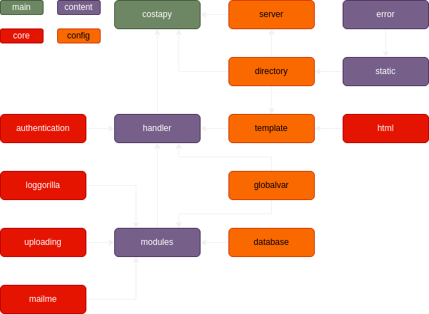

# Known the structure

It have a 4 type of file:
- Main
- Core
- Configuration
- Content

`Main` is the file that you will run with the Python.

`Core` is the place to put the extension script.

`Configuration` is for configuration.

and `Content` is the place for you to create a content.
